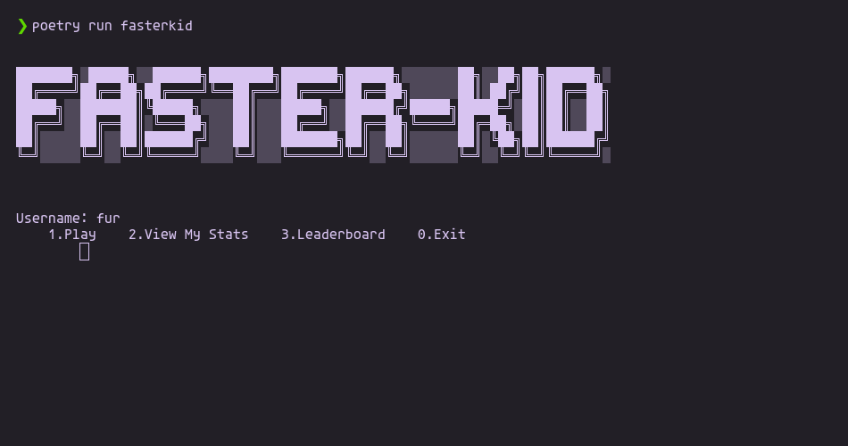
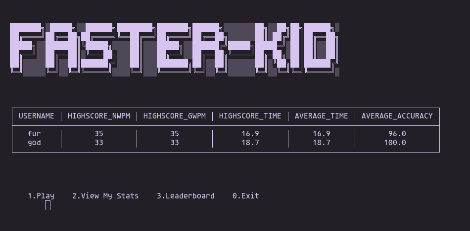

# FASTER-KID [CLI]

A cli based typing speed test program that uses python and its built-in libraries to perform operations. It also has a user-wise data recording and the power to check previous typing history and best times. It also has a leaderboard to view the player with best record

---
## How to use:
- Clone the repo :
```
git clone https://github.com/ogdhruv/Faster-Kid.git
```

- In the bash or command prompt use the following command :
```
poetry run fasterkid
```
- After running program in terminal<br>

  > enter username : **yourname**
---

## Features

- Uses the command line interface
- Menu Based
- Faster
- Can store and view previous runs
- Leaderboard
- Ability to view data in the form of a clean table
---
### Visuals





